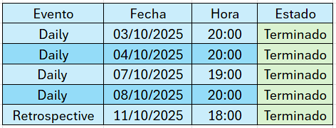
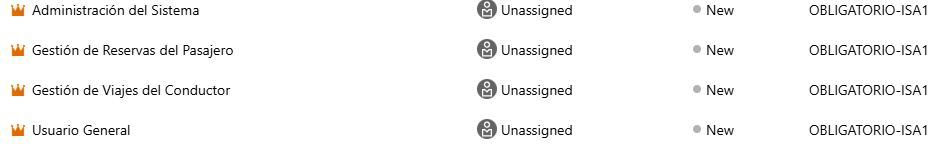
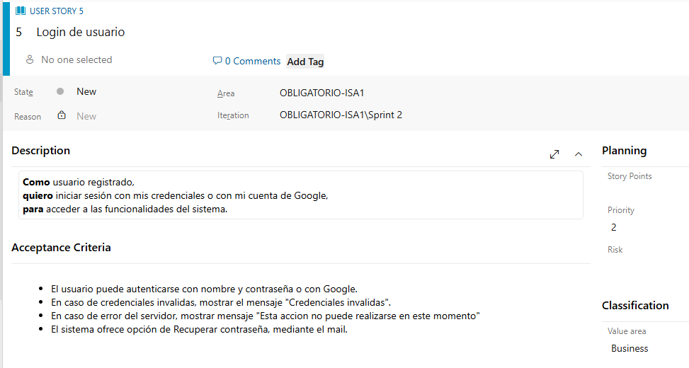
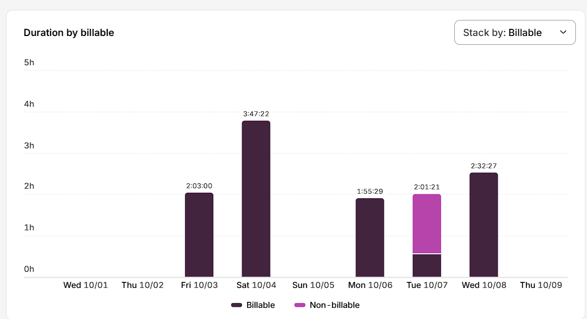

# Indice

- [Gestión de la iteración](#gestión-de-la-iteración)
  - [Definición del marco de trabajo](#definición-del-marco-de-trabajo)
  - [Planificación de la iteración](#planificación-de-la-iteración)
  - [Seguimiento de la iteración](#seguimiento-de-la-iteración)
  - [Inspección y adaptación del proceso](#inspección-y-adaptación-del-proceso)
- [Identificar y definir el problema a resolver](#identificar-y-definir-el-problema-a-resolver)
  - [Identificación del problema a resolver](#identificación-del-problema-a-resolver)
  - [Definición del problema/solución](#definición-del-problema/solución)

# Gestión de la iteración

## Definición del marco de trabajo

## Acuerdos de las jornadas de trabajo

- Definimos realizar las daily dia por medio alrededor de las 20:00 hs por temas personales (trabajo/estudio, entre otros) para hacer un breve resumen personal en lo que se va a trabajar y si algun integrante tiene algun inconveniente 
- Creemos adecuado tener reuniones con esta frecuencia para optimizar el tiempo de trabajo  y que las daily sean productivas.  

## Roles

### Product Owner
El Product Owner representa al cliente dentro del equipo, comunica las necesidades y prioridades del negocio, y decide qué funcionalidades se desarrollarán en cada iteración.

### Scrum Master
El Scrum Master facilita el trabajo del equipo, asegurándose de que se sigan las prácticas de Scrum, ayudando a resolver problemas y fomentando la colaboración para entregar valor al cliente.

### Developer
El Developer se encarga de implementar las funcionalidades, trabajando en equipo y junto al Product Owner para cumplir los objetivos de cada sprint.

## Roles por integrante

Product Owner: Franco Ramos  
Scrum Master: Agustin Peraza  
Developer: Santiago Meizoso 

Adjunto en la imagen a continuación la definición del calendario de eventos  
  

### Definition of Done

Se considera completada una historia de usuario cuando se cumplen los siguientes criterios:
- Se integro la historia al codigo y paso las pruebas unitarias. 
- Fue validada por el Product Owner.
- Se encuentra lista para ser desplegada.   

Es importante tener en cuenta que no se trata solo de haber pasado a codigo las historias listas, sino tambien validar, probar, documentar y garantizar que aporte valor real al cliente.

### Definition of Ready

Una historia de usuario se considera lista para su desarrollo cuando:
- Se definio de manera clara y concisa, es decir, todos los miembros del equipo la entienden.
- Se definio el critero de aceptacion. (Enunciado que define las condiciones para que sea considerada completa)
- Debe aportar valor para el cliente, que sea relevante.
- Debe poder completarse de forma independiente a las demas historias de usuario.
- Debe ser realizable durante una iteracion. De no serlo debe ser dividida.
- Debe esta priorizada.

## Planificación de la iteración

En esta etapa el objetivo principal es comprender a fondo lo que solicita el cliente y traducirlo en entregables concretos definidos. Para lograr esto se necesita:

### Comprensión del requerimiento del cliente

Se revisan las necesidades planteadas y se asegura que todo el equipo tenga una visión compartida del objetivo de la iteración.

### Definición de roles dentro del Scrum Team

Se establecen claramente las responsabilidades de Product Owner, Scrum Master y Developer, con el fin de organizar la comunicación y la ejecución del sprint.

### Épicas

Al momento de crear épicas, el criterio que seguimos fue separar cada perfil de usuario del sistema y agrupar sus funcionalidades. 

### Criterios de aceptación para las historias de usuario

Cada historia de usuario tiene su propio criterio de aceptación, el cual debe cumplirse en su totalidad como uno de los requisitos para marcarla como completada. (Ver Definition of Done)    

### Creación de User Stories en el Product Backlog

A partir de los requerimientos, se redactan historias de usuario que representen el valor esperado por el cliente, siguiendo el formato estándar (Como [usuario], quiero [funcionalidad], para [beneficio]). A continuación un ejemplo:

### Priorización y estimación

Se utiliza la técnica de Planning/Estimation Poker para asignar esfuerzo relativo a cada historia, y en base a esto, determinar su prioridad. Esto asegura que se planifiquen las tareas de acuerdo con la capacidad y velocidad disponible del equipo.

**insertar imagen de ejemplo**

### Construcción del Sprint Backlog

Con las historias priorizadas y estimadas, se seleccionan las que podrán desarrollarse en la iteración. A partir de ellas se definen las tareas concretas que cada miembro del equipo asumirá.
 
**realizar el sprint planning y adjuntar imagenes**

### Artefactos principales

- Minuta de la sprint planning con su agenda, actividades y resultados.
- Objetivos de la iteración.
- Sprint backlog con historias de usuarios y tareas asociadas.
- Planificación de acuerdo a la capacidad del equipo.
- Técnicas de priorización y estimación utilizadas.

## Seguimiento de la iteración

### Daily Scrum

Es una reunión diaria de corta duración en la que el equipo de desarrollo revisa el progreso hacia el objetivo del Sprint e identifica impedimentos, promoviendo transparencia y coordinación.

En la siguiente carpeta se pueden apreciar imágenes de los daily:

[Ver Daily Scrum](./dailyscrum) 

### Toggl

Toggl es una aplicación de gestión del tiempo que permite registrar y monitorear las horas dedicadas a distintas tareas y proyectos. Se utiliza tanto de forma individual como en equipos de trabajo, ya que ofrece reportes y estadísticas que facilitan el análisis de productividad.

[Ver Toggl](./toggl) **agregar carpeta con imagenes**  
Esta grafica representa las horas de trabajo sobre el proyecto en la primera semana, cuando un miembro del equipo empieza a trabajar, comienza un cronometro que luego se suma al tiempo total de trabajo.
  

**Seguimiento visual de la iteración con burndown y/o burnup charts**

## Inspección y adaptación del proceso

_[Existe evidencia sobre la inspección del proceso con aprendizajes principales y acciones de mejora implementadas durante el desarrollo del proyecto.]_

### Artefactos principales

- Minuta de la retrospectiva con la dinámica utilizada y sus principales resultados.
- Planificación y seguimiento de las acciones de mejora.

# Identificar y definir el problema a resolver

## Identificación del problema a resolver

### Objetivo

Desarrollar una aplicación de carpooling universitario que permita vincular a estudiantes que ofrecen lugares en sus vehículos con aquellos que necesitan trasladarse hacia o desde la facultad.

### Interesados

Son individuos, grupos u organizaciones que pueden afectar, verse afectados, o ser percibidos como afectados por un proyecto.

[Ver Interesados](./interesados.md)

### Funcionalidades

Listado detallado de las características clave que deberá ofrecer la aplicación para cumplir con el MVP planteado.

[Ver Funcionalidades](./funcionalidades.md)

### Competidores

Los competidores son empresas, productos o servicios que buscan satisfacer las mismas necesidades o mercados que otro.

[Ver Competidores](./competidores.md)

## Definición del problema/solución

### Product Backlog

El Product Backlog es un artefacto de Scrum que representa una lista dinámica, priorizada y en constante cambio de todos los elementos necesarios para desarrollar  un producto. Contiene historias de usuario, requisitos funcionales y no funcionales, mejoras y correcciones que aportan valor al cliente. 

**instertar enlace a carpeta con imagenes de las user story y las épicas**

**Story map del roadmap inicial del proyecto**
