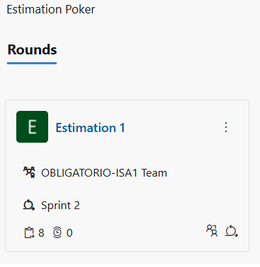
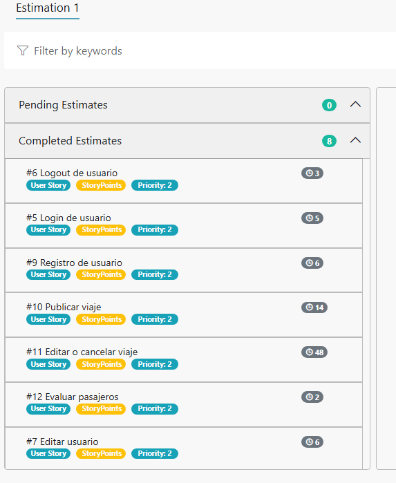
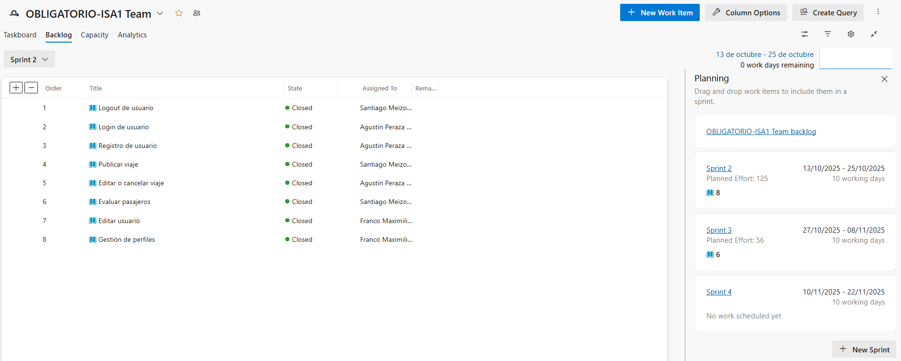
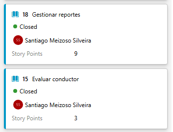
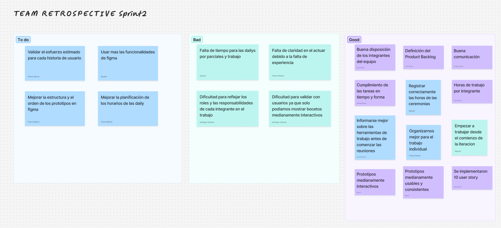

# Indice

- [Gestión de la iteración](#gestión-de-la-iteración)
  - [Definición del marco de trabajo](#definición-del-marco-de-trabajo)
  - [Planificación de la iteración](#planificación-de-la-iteración)
  - [Seguimiento de la iteración](#seguimiento-de-la-iteración)
  - [Inspección y adaptación del proceso](#inspección-y-adaptación-del-proceso)
- [Construir y validar posibles soluciones del MVP a través de prototipos](#construir-y-validar-posibles-soluciones-del-mvp-a-través-de-prototipos)
  - [Prototipos con posibles soluciones](#prototipos-con-posibles-soluciones)
  - [Inspección y adaptación del producto](#inspección-y-adaptación-del-producto)

# Gestión de la iteración

## Definición del marco de trabajo

En esta iteración seguimos trabajando con el marco **Scrum**, con los roles ya definidos y realizando los diferentes prototipos designados para esta iteración.
  
## Roles y responsabilidades

**Product Owner:** Franco Ramos  
**Scrum Master:** Agustin Peraza  
**Developer:** Santiago Meizoso 

## Políticas de trabajo

**Definition of Done:** Una historia de usuario la consideramos finalizada cuando su prototipo fue completado, validado en las pruebas de usabilidad y aprobado por los usuarios (ver validación con usuarios).

**Definition of Ready:** Las historias de usuario las consideramos listas si cumplen con el modelo INVEST, si estan correctamente priorizadas y si cuentan con criterios de aceptación claros antes de iniciar los diseños de sus prototipos.

## Sprint Planning

Para este sprint se realizó una estimación de los story points de las user story para estimar la duración de su prototipado, a continuación la imágenes:

En total se lograron concretar 10 user story, ya que la velocidad del equipo de desarrollo fue eficiente se implementaron además 2 user story asignadas para la siguiente iteración.

## Seguimiento de la iteración

### Daily Scrum

En la siguiente carpeta se pueden apreciar imágenes de los daily.

[Ver Daily Scrum](./dailyscrum) 

### Toggl

En la carpeta a continuacion se encuentran distintas métricas de Toggl sobre el trabajo en equipo, mostrando el progreso del proyecto en horas de trabajo.

[Ver Toggl](./toggl)

## Inspección y adaptación del proceso

Realizamos una ceremonia de sprint retrospective con tres clasificaciones:  
- **To do**: Aspectos que nos gustaria implementar en proximas iteraciones.  
- **Bad**: Aspectos a mejorar.  
- **Good**: Cosas que hicimos bien y deberiamos seguir realizando.  

  

# Construir y validar posibles soluciones del MVP a través de prototipos

## Prototipos con posibles soluciones

### Figma

Figma es una herramienta de diseño colaborativo en línea que permite crear y prototipar interfaces de usuario de forma visual y en tiempo real. Facilita el trabajo en equipo, ya que varios usuarios pueden diseñar, revisar y comentar simultáneamente desde el navegador.

En la carpeta a continuación se pueden apreciar imágenes de los prototipos realizados en esta iteración:

[Ver Prototipos](./figma) 

## Inspección y adaptación del producto

### Validacion con usuarios

Se otorgaron permisos a distintos alumnos de la universidad ORT para visualizar y testear los prototipos creados hasta el momento. Cabe destacar que los prototipos no son todavía del todo interactivos ya que el MVP no esta finalizado. De todas formas el feedback obtenido fue bueno y optimista para seguir el desarrollo de la app. 

Se destacaron las siguientes afirmaciones en el feedback de los usuarios:

- La interfaz es simple y mantiene el formato de android
- La interaz es moderna y atractiva
- La idea de compartir viajes entre estudiantes parece muy útil y práctica
- Sería interesante agregar filtros como facultad, carrera o turno para encontrar viajes más fácilmente
- Da una buena primera impresión, los usuarios estan dispuestos a probar la versión funcional cuando esté lista
- El prototipo logra transmitir la propuesta de valor, aun sin ser completamente interactivo

