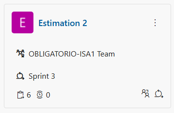
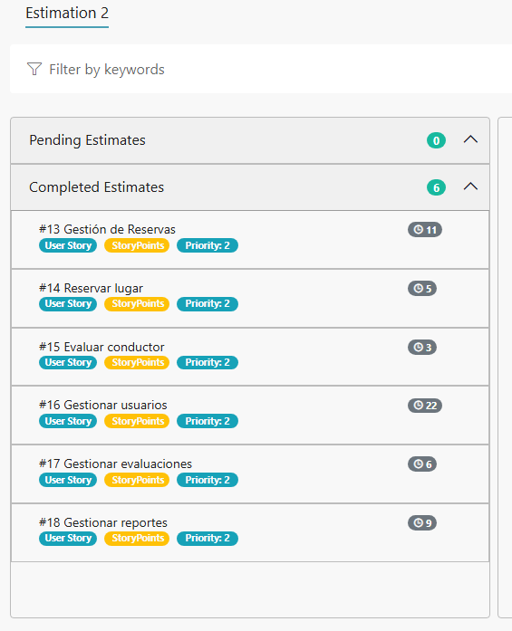

# Indice

- [Gestión de la iteración](#gestión-de-la-iteración)
  - [Definición del marco de trabajo](#definición-del-marco-de-trabajo)
  - [Planificación de la iteración](#planificación-de-la-iteración)
  - [Seguimiento de la iteración](#seguimiento-de-la-iteración)
  - [Inspección y adaptación del proceso](#inspección-y-adaptación-del-proceso)
- [Construir y validar posibles soluciones del MVP a través de prototipos](#construir-y-validar-posibles-soluciones-del-mvp-a-través-de-prototipos)
  - [Prototipos con posibles soluciones](#prototipos-con-posibles-soluciones)
  - [Inspección y adaptación del producto](#inspección-y-adaptación-del-producto)

# Gestión de la iteración

## Definición del marco de trabajo

En esta iteración seguimos trabajando con el marco **Scrum**, con los roles ya definidos y realizando los diferentes prototipos designados para esta iteración.
  
## Roles y responsabilidades

**Product Owner:** Franco Ramos  
**Scrum Master:** Agustin Peraza  
**Developer:** Santiago Meizoso 

## Políticas de trabajo

**Definition of Done:** Una historia de usuario la consideramos finalizada cuando su prototipo fue completado, validado en las pruebas de usabilidad y aprobado por los usuarios (ver validación con usuarios).

**Definition of Ready:** Las historias de usuario las consideramos listas si cumplen con el modelo INVEST, si estan correctamente priorizadas y si cuentan con criterios de aceptación claros antes de iniciar los diseños de sus prototipos.

## Planificación de la iteración

Para este sprint se realizó una estimación de los story points de las user story utilizando la metodología ágil conocida como *Estimation Poker* para estimar la duración de su prototipado, a continuación la imágenes:

A diferencia de las demás entregas en esta iteracion es donde el equipo se planteo como objetivo principal concretar un MVP del carpooling universitario solicitado por el cliente previamente testeado por distintos tipos de usuarios.

**Agregar el Product Backlog**

### Artefactos principales

- Minuta de la sprint planning con su agenda, actividades y resultados.
- Objetivos de la iteración.
- Sprint backlog con historias de usuarios y tareas asociadas.
- Planificación de acuerdo a la capacidad del equipo.
- Técnicas de priorización y estimación utilizadas.
- Uso de métricas relevantes para la planificación como la velocidad y productividad.

## Seguimiento de la iteración

_[Existe evidencia sobre el registro de actividades y horas de cada integrante del equipo con el seguimiento general de cada iteración del proyecto sobre lo planificado inicialmente.]_

### Artefactos principales

- Minuta de daily scrum describiendo la coordinación del trabajo de cada integrante del equipo.
  - ¿Que logramos hacer?
  - ¿Qué planificamos hacer?
  - ¿Qué impedimentos tenemos?
- Registro y reporte de horas de cada integrante del equipo con sus actividades principales.
- Seguimiento visual de la iteración con burndown y/o burnup charts.

## Inspección y adaptación del proceso

_[Existe evidencia sobre la inspección del proceso con aprendizajes principales y acciones de mejora implementadas durante el desarrollo del proyecto.]_

### Artefactos principales

- Minuta de la retrospectiva con la dinámica utilizada y sus principales resultados.
- Planificación y seguimiento de las acciones de mejora.

# Construir y validar posibles soluciones del MVP a través de prototipos

## Prototipos con posibles soluciones

_[Existen diferentes propuestas de solución para entregar valor y resolver el problema identificado implementado a través de prototipos. Los prototipos deberán ser exportados en algún formato de imagen (como png o jpg) a efectos de poder ser visualizados fácilmente dentro del propio repo de github.]_

### Artefactos principales

- Prototipos interactivos para ser navegados.
- Prototipos asociados como bocetos a las historias de usuario.

## Inspección y adaptación del producto

_[Existe evidencia de instancias de inspección y validación del producto con usuarios y la recolección de su feedback con ajustes finales a los prototipos.]_

### Artefactos principales

- Minutas de sprint review.
- Evidencia de los usability testing con usuarios finales.
  - Descripción de las tareas propuestas a los usuarios finales.
  - Cobertura obtenida de validación de los usuarios de la aplicación.
- Feedback recibido de los usuarios finales con la priorización de las propuestas de cambio.
