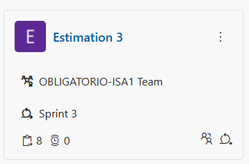
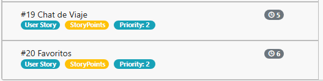
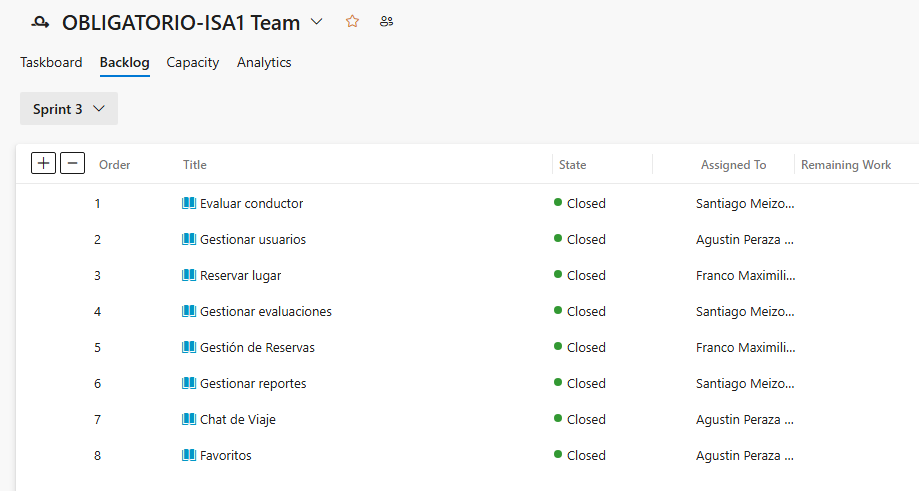
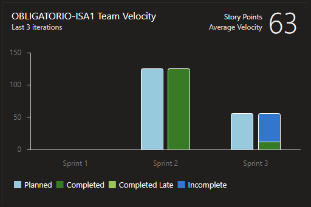
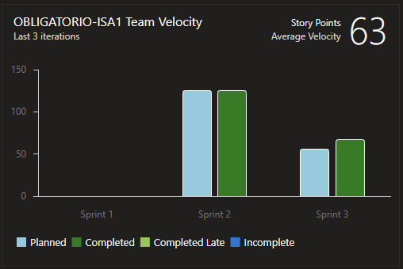
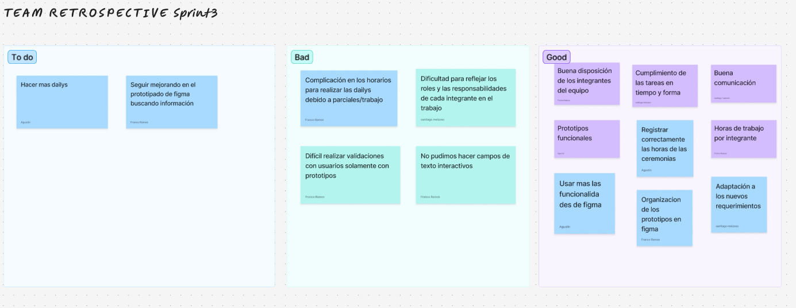
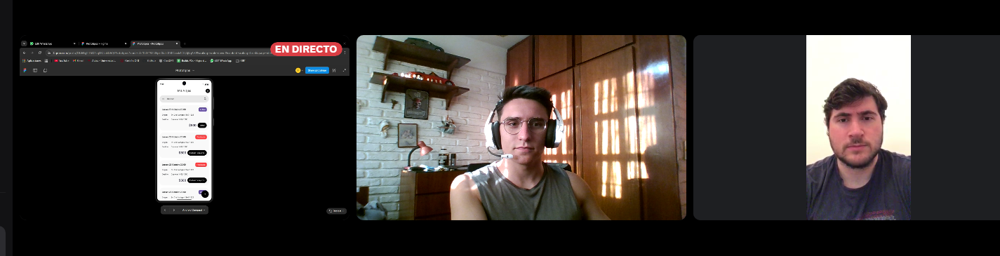

# Indice

- [Gestión de la iteración](#gestión-de-la-iteración)
  - [Definición del marco de trabajo](#definición-del-marco-de-trabajo)
  - [Planificación de la iteración](#planificación-de-la-iteración)
  - [Seguimiento de la iteración](#seguimiento-de-la-iteración)
  - [Inspección y adaptación del proceso](#inspección-y-adaptación-del-proceso)
- [Construir y validar posibles soluciones del MVP a través de prototipos](#construir-y-validar-posibles-soluciones-del-mvp-a-través-de-prototipos)
  - [Prototipos con posibles soluciones](#prototipos-con-posibles-soluciones)
  - [Inspección y adaptación del producto](#inspección-y-adaptación-del-producto)

# Gestión de la iteración

## Definición del marco de trabajo

En esta iteración seguimos trabajando con el marco **Scrum**, con los roles ya definidos y realizando los diferentes prototipos designados para esta iteración.
  
## Roles y responsabilidades

**Product Owner:** Franco Ramos  
**Scrum Master:** Agustin Peraza  
**Developer:** Santiago Meizoso 

## Políticas de trabajo

**Definition of Done:** Una historia de usuario la consideramos finalizada cuando su prototipo fue completado, validado en las pruebas de usabilidad y aprobado por los usuarios (ver validación con usuarios).

**Definition of Ready:** Las historias de usuario las consideramos listas si cumplen con el modelo INVEST, si estan correctamente priorizadas y si cuentan con criterios de aceptación claros antes de iniciar los diseños de sus prototipos.

## Planificación de la iteración

Para este sprint se realizó una estimación de los story points de las user story utilizando la metodología ágil conocida como *Estimation Poker* para estimar la duración de su prototipado, a continuación la imágenes:

Previo a esta iteración se llevó a cabo una reunión con los sponsor del proyecto y en base a esta surgieron nuevos requerimientos y se ajustaron algunos de los existentes, por lo tanto, se crearon nuevas User Story para dichos requerimientos. Posterior a su creación se hicieron las estimaciones respectivas. A continuación las imágenes:

A diferencia de las demás entregas en esta iteracion es donde el equipo se planteo como objetivo principal concretar un MVP del carpooling universitario solicitado por el cliente previamente testeado por distintos tipos de usuarios.

En total se lograron concretar 6 user story, la velocidad del equipo de desarrollo fue eficiente y no tuvo cambios con respecto a la iteración anterior.

Velocidad de la segunda iteración:

Velocidad de la tercera iteración: 

## Seguimiento de la iteración

### Daily Scrum

En la siguiente carpeta se pueden apreciar imágenes de los daily.

[Ver Daily Scrum](./dailyscrum) 

### Toggl

En la carpeta a continuacion se encuentran distintas métricas de Toggl sobre el trabajo en equipo, mostrando el progreso del proyecto en horas de trabajo.

[Ver Toggl](./toggl)

### Story Map

[Ver Toggl](./storymap)

## Inspección y adaptación del proceso

Realizamos una ceremonia de sprint retrospective con tres clasificaciones:  
- **To do**: Aspectos que nos gustaria implementar en proximas iteraciones.  
- **Bad**: Aspectos a mejorar.  
- **Good**: Cosas que hicimos bien y deberiamos seguir realizando.  

# Construir y validar posibles soluciones del MVP a través de prototipos

## Prototipos con posibles soluciones

### Figma

En la carpeta a continuación se pueden apreciar imágenes de los prototipos realizados en esta iteración:

[Ver Prototipos](./figma) 

## Inspección y adaptación del producto

Se realizo una validación del MVP del proyecto de carpooling universitario.   Para lograr esto se le presentó a un profesor y a un alumno de la universidad ORT para visualizar los prototipos creados hasta el momento. El feedback obtenido en términos generales fue satisfactorio. A continuación las imágenes y los comentarios de los usuarios:

*Felipe Ghione* - estudiante de la carrera ingeniería en sistemas en la ORT (actualmente realizando la tesis de dicha carrera)

Me parecio que representaron muy bien como se vería una aplicacion de carpooling, bien lograda la estetica. La aplicación se siente familiar, se ve inspiración en aplicaciones similares como Uber, Viatik, Cabify. Podrían agregar detalles que la hagan sentir más personalizada, como un saludo al usuario o una paleta de colores asociados a la universidad. En términos generales muy buen flujo, sorprende ya que son solamente prototipos de una app.

*Santiago Gonzalez* - estudiante de la carrera ingeniería en sistemas y profesor en la ORT de las materias: Sitemas Operativos e Ingeniería de Software Ágil 2

**Insertar imágen de la reunión**

Se nota que trabajaron con una idea clara de a quién va dirigida y qué problema quieren resolver. El flujo entre pantallas es intuitivo y la estética encaja bien con un público universitario.
Trabajaron bien la estructura general: se entiende rápido cómo buscar, editar o publicar un viaje, entre otras funciones. Capaz podrían pulir un poco más algunos detalles visuales , por ejemplo  mantener la misma estetica visual en todas las pantallas o usar íconos y botones consistentemente.